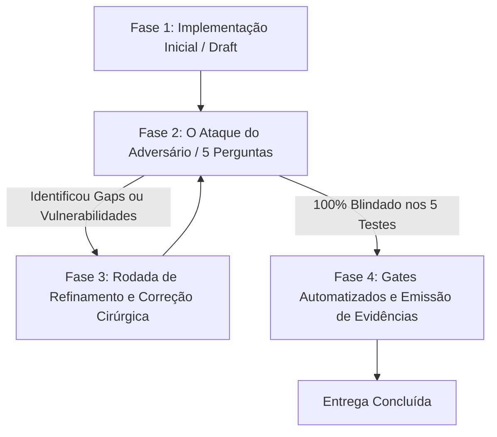

# Universal Quality Gate & Hardening Loop (Almoxarifado SaaS - v5.0)

Este skill define o **harness comportamental com loop de reflexão obrigatório**. Ele foi projetado para combater a pressa natural de modelos rápidos (como Gemini Flash) em declarar conclusão precipitada, impondo um **ciclo fechado de auto-questionamento e auto-refinamento** antes de qualquer entrega.

---

## 🔄 O Loop de Auto-Questionamento e Refinamento (The Reflective Adversary Loop)

Todo ciclo de trabalho DEVE percorrer obrigatoriamente as **4 Fases do Loop**:

### 🛑 REGRA DO BLOQUEIO COGNITIVO
> **É EXPRESSAMENTE PROIBIDO** responder ao usuário com a conclusão da tarefa imediatamente após o primeiro `write_to_file` ou após o `lint`.
> Você **DEVE** executar o auto-questionamento mental da Fase 2 e auditar ativamente o diff antes de liberar a entrega.

---

### Fase 1: Implementação / Ação
- Execução cirúrgica do escopo solicitado seguindo os padrões arquiteturais de backend e frontend descritos abaixo.

---

### Fase 2: O Ataque do Adversário (As 5 Perguntas de Auto-Interrogação)
O agente deve interrogar seu próprio código contra os 5 vetores de falha:

1. **Vetor 1 (Queda de Rede / 500 / 403):**
   * *Pergunta:* "Se o backend retornar 500, 403 ou timeout, a UI explode, mente exibindo '0 colaboradores / tudo em dia', ou renderiza tabelas/cards vazios abaixo do erro?"
   * *Exigência:* Ocultação hermética de tabelas/cards sob erro + banner explicativo + botão retry.

2. **Vetor 2 (Auditoria de Escopo Cruzado / Anti-Visão de Túnel):**
   * *Pergunta:* "Eu olhei apenas para o arquivo solicitado ou verifiquei se outros arquivos do mesmo diff / outros módulos do app contêm essa mesma falha?"
   * *Exigência:* Rodar `grep_search` nos fluxos análogos do workspace e corrigir em conjunto.

3. **Vetor 3 (Matriz de Permissões & Hierarquia de Acesso):**
   * *Pergunta:* "Um perfil intermediário (ex: `GESTOR` ou `ALMOXARIFE`) consegue ver selects, botões ou disparar requisições que tomam 403 no servidor?"
   * *Exigência:* Ocultar ou desabilitar na UI qualquer ação não permitida para o perfil da sessão.

4. **Vetor 4 (Tetos de Query, CAS & Tenant Isolation):**
   * *Pergunta:* "Existe algum `findMany` sem `take` (mesmo em relatórios)? Existe algum `findUnique` que ignora `empresaId`? O estoque é debitado com CAS em transação?"
   * *Exigência:* `take: 100-200` em telas, `take: 1000` em relatórios, `findFirst({ where: { id, empresaId } })` e `$transaction` atômica com CAS.

5. **Vetor 5 (Resiliência Assíncrona & Tipografia Mobile):**
   * *Pergunta:* "Se a conexão cair no meio de um salvamento, o botão fica congelado em 'Salvando...' por falta de `finally`? Os inputs móveis usam `text-base md:text-sm` (16px base) para evitar zoom no iOS?"
   * *Exigência:* `try / catch / finally` com reset de estado em todas as mutações e inputs com fonte mínima de 16px no mobile.

---

### Fase 3: Rodada de Refinamento (Self-Correction)
- Se qualquer uma das 5 perguntas revelar um gap, execute correções imediatas nos arquivos afetados.
- Repita o auto-questionamento até que os 5 vetores estejam completamente satisfeitos.

---

### Fase 4: Portão de Execução Verificável & Evidências
1. `npm run lint` → 0 erros e 0 warnings.
2. `npm run test:coverage:core` (ou testes unitários de domínio/autorização) → 100% de aprovação.
3. Playwright Visual Matrix (para alterações de UI) → Validação visual de screenshots mobile/desktop.

---

## 🏛️ Invariantes Universais do Almoxarifado SaaS

### 1. Multi-Tenancy, Segurança & Realtime
- **Tenant-Safe Queries:** Proibido `findUnique({ where: { id } })` em tabelas com empresa; usar `findFirst({ where: { id, empresaId } })`.
- **Tetos de Busca & Paginação:** Proibido `findMany` sem `take` (listagens: 100–200; relatórios/exportações: 1000). Paginações devem expor `nextCursor`/`hasMore` ou contagem agregada em banco.
- **Row Level Security (RLS):** Todas as tabelas de dados do sistema (incluindo Chat e Realtime) DEVEM possuir `ENABLE ROW LEVEL SECURITY` e policies atreladas a `auth.uid()` e `empresaId`.
- **Realtime Autorizado:** Canais Realtime/WebSockets DEVEM ser privados com autorização JWT e roteamento multi-tenant seguro (nunca tópicos públicos com nomes previsíveis sem autorização).
- **CAS & Transações:** Estoque debitado com Compare-And-Swap (`quantidadeAtual: { gte: qtd }`) em `prisma.$transaction`.
- **Pares Determinísticos:** Relações 1:1 (como canais diretos) DEVEM usar chaves determinísticas unívocas (`empresaId:min(u1,u2):max(u1,u2)`) com unique constraint e catch de `P2002` para evitar duplicações por concorrência.
- **ACL de Canteiro Cruzada:** Anexos, movimentações e seleções de materiais DEVEM validar estritamente o `canteiroId` do `ALMOXARIFE` antes de qualquer persistência, rejeitando acessos a outros canteiros da mesma empresa com 403.
- **Hierarquia:** `DIRETOR` > `ADMIN` > `GESTOR` > `ALMOXARIFE` > `PENDENTE`. GESTOR nunca pode alterar GESTOR/ADMIN.

### 2. Módulos de Domínio
- **Estoque/Itens:** Conservação (`NOVO` a `INSERVIVEL`) e tipo de controle (`INDIVIDUAL` vs `LOTE`).
- **Movimentações:** `POST /api/movimentacoes` aceita **somente** `SAIDA` direta.
- **Transferências:** Origem ≠ Destino e movimentação de saldo atômica na aprovação do destinatário.
- **Cautelas:** Devolução atômica restaurando estoque com estado de conservação no retorno.
- **NF-e:** Chave de acesso única de 44 dígitos por empresa.
- **Solicitações:** Justificativa obrigatória em caso de recusa.
- **Chat & Mensagens:** Mensagens persistidas no banco como fonte da verdade com broadcast de WebSocket tratado em best-effort e suporte a idempotência.

### 3. Contratos de Frontend & Concorrência
- **Race Condition Shield:** Alternância de canais ou filtros assíncronos DEVE usar `AbortController` e verificação de identificador ativo antes de aplicar estados em tela.
- **Isolamento Hermético:** Sob erro de carga, ocultar totalmente listas/tabelas vazias e exibir card de erro com retry.
- **Try/Finally:** Reset obrigatório de `salvando`/`loading` no bloco `finally`.
- **Mobile UX:** `text-base md:text-sm` em todos os inputs/selects e `overflow-x-auto` em tabelas largas.
- **Zero Lazy Casts:** Proibido `any`, `@ts-ignore` e `session as any`.
